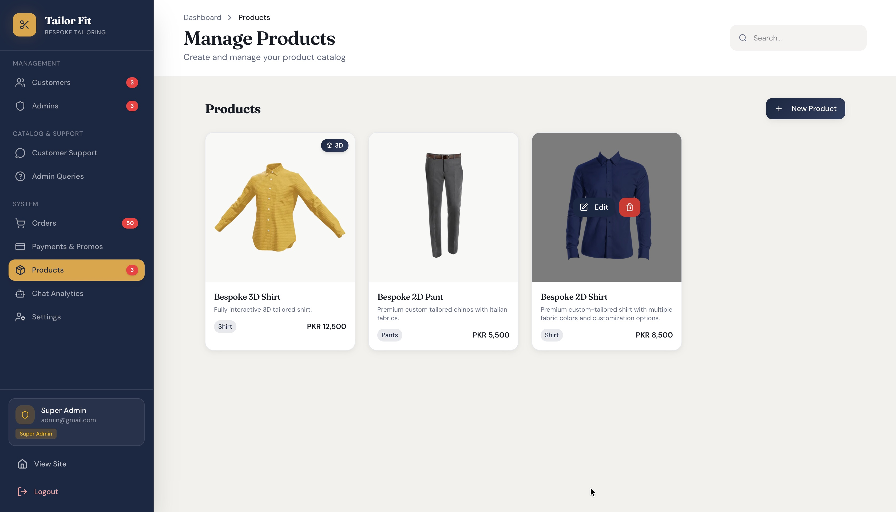

# Tailor Fit — Premium Custom Clothing Platform

**[🔗 Live Demo](https://tailor-fit-darosoft.duckdns.org)** · **[📜 Changelog](./CHANGELOG.md)** · **[📁 Operational Docs](./docs/)**

> A production-grade bespoke tailoring platform with dual 2D/3D garment customization engines, real-time AI-powered customer support, and a multi-role admin dashboard — built for the Pakistani luxury market.

---

## Contents
[Core Engine Capabilities](#core-engine-capabilities) · [Technology Stack](#technology-stack) · [Development Timeline](#development-timeline) · [Operational Documentation](#operational-documentation)

---

## Interactive Design Showcase

  <video src="https://github.com/user-attachments/assets/f12872e7-bb3c-4213-aa5f-386a50d8da42" width="100%" autoplay muted loop playsinline></video>

<i>3D Design Engine — Immersive, studio-quality garment configuration.</i>

> 📸 Live engine available at [tailor-fit-darosoft.duckdns.org](https://tailor-fit-darosoft.duckdns.org)

---

## Key Features at a Glance

|      3D Customizer       |       E-Commerce        |        AI & Real-Time        |
|--------------------------|-------------------------|------------------------------|
| **PBR Fabric Rendering** | Secure JWT Auth         | **Gemini AI Support**        |
| Meshopt/KTX2 Compression | Safepay V1 (PCI)        | **Socket.io Infrastructure** |
| Dynamic Mesh Toggling    | Cart & Checkout         | **Live Admin Notifications** |
| Cinematic Transitions    | SEO Slugs & Metadata    | Multi-Role Dashboard         |

---

## Core Engine Capabilities

### High-Fidelity 3D Customizer
Leveraging **React Three Fiber** and **Three.js**, the 3D engine provides an immersive, studio-quality preview:
- **Interactive PBR Rendering:** Physically Based Rendering for realistic fabric textures (Color, Normal, Roughness).
- **Modular Component Logic:** Dynamic mesh toggling for collars, cuffs, pockets, and other bespoke details.
- **Cinematic Experience:** Smooth camera lerping, directional ambient lighting, and elegant crossfade transitions.
- **Optimized Assets:** High-performance delivery using `@gltf-transform` and `gltfpack` (Meshopt/KTX2).

### Intelligent 2D Customizer
A lightweight, lightning-fast layering engine for complex garment configurations:
- **Zero-Flash Transitions:** Pre-mounted states ensure seamless switching between customization steps.
- **Precision Layering:** Multi-layered Z-index composition for accurate garment visualization.
- **Unified Controls:** Synchronized UI state between 2D and 3D customizers for a consistent user journey.

### Real-Time Support & AI Integration
A robust communication layer for instant customer engagement and administrative control:
- **Gemini-First Chat:** AI-powered customer assistance with intelligent context awareness and human escalation fallback.
- **Socket.io Infrastructure:** Auth-aware rooms for live order updates, admin-customer messaging, and system-wide synchronization.
- [ ] **Admin Command Center:** Real-time conversation tracking, notification dispatch, and AI usage analytics.

<i>The unified Admin Command Center for real-time order and AI management.</i>

---

## Technology Stack

### Frontend Architecture
- **Framework:** React 18 + Vite 7 + TypeScript
- **Styling:** Tailwind CSS v4 + Shadcn/UI (Native CSS implementation)
- **3D Graphics:** Three.js + React Three Fiber + Drei
- **Native Support:** Capacitor v8 (Android & iOS)
 
### Interface Previews

  <video src="https://github.com/user-attachments/assets/298f1c82-c694-47e4-addc-a475bf89cfd9" width="100%" autoplay muted loop playsinline></video>

<i>Desktop Interface — High-fidelity garment customization on large screens.</i>

 

  <video src="https://github.com/user-attachments/assets/7a9c10ba-bf4b-421b-9f5d-1b42fe80495f" width="300" autoplay muted loop playsinline></video>

<i>Mobile App Interface — Pixel-perfect responsiveness on the go.</i>

### Backend & Infrastructure

- **Runtime:** Node.js + Express 5
- **Persistence:** MongoDB + Mongoose ORM
- **Object Storage:** Cloudinary (Dynamic Optimization Pipe)
- **Real-time:** Socket.io (Auth-aware)
- **Payments:** Safepay V1 Integration (PCI-Compliant Hosted Checkout)

---

## Operational Documentation

To protect project integrity and specialized workflows, detailed setup and deployment instructions are stored in the internal `/docs` repository. 

### Documentation Index
*   **[Setup & Installation](./docs/LOCAL_DEV_SETUP.md)**: Local developer environment procedures.
*   **[Deployment Guide](./docs/DEPLOYMENT_GUIDE.md)**: Production strategies for Vercel, Render, and VPS.
*   **[Asset Pipeline](./docs/GLB_COMPRESSION_WALKTHROUGH.md)**: 3D model compression and HDR downscaling walkthrough.
*   **[Cloudinary Lifecycle](./docs/CLOUDINARY_ASSET_LIFECYCLE.md)**: Folder hierarchy and automated asset cleanup rules.
*   **[Safepay Integration](./docs/Safepay_API_Reference.md)**: Payment gateway configuration and webhook handling.
*   **[Mobile App Guide](./docs/MOBILE_APP_GUIDE.md)**: Capacitor v8 builds for Android and iOS.
*   **[Manual Testing](./docs/MANUAL_TESTING_GUIDE.md)**: End-to-end verification checklist for pre-release audits.

---

**Tailor Fit** — Maintained & Developed by Sandeep.  
Built across 103 engineering phases · [Full History →](./CHANGELOG.md)

